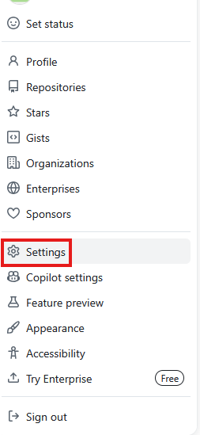
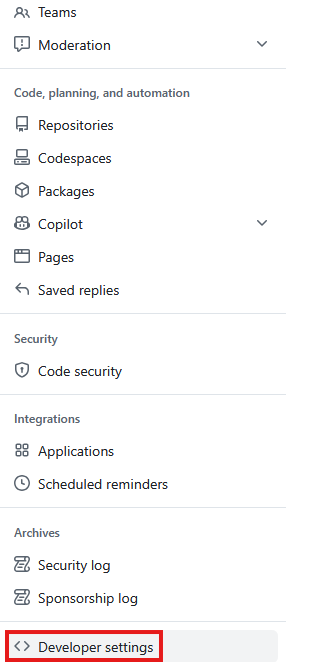
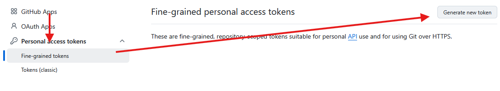
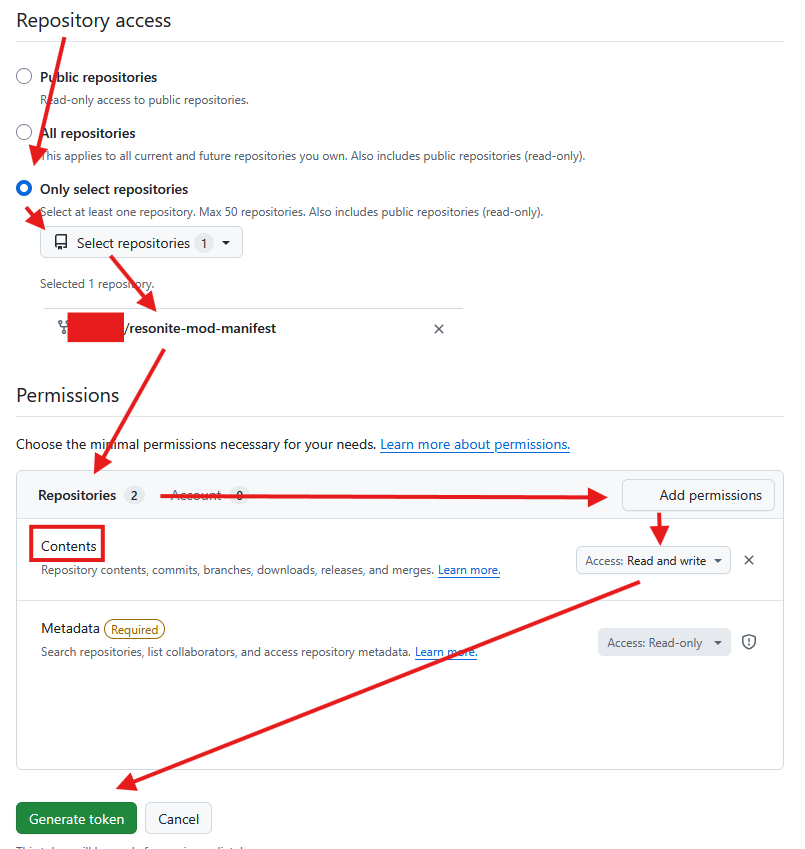
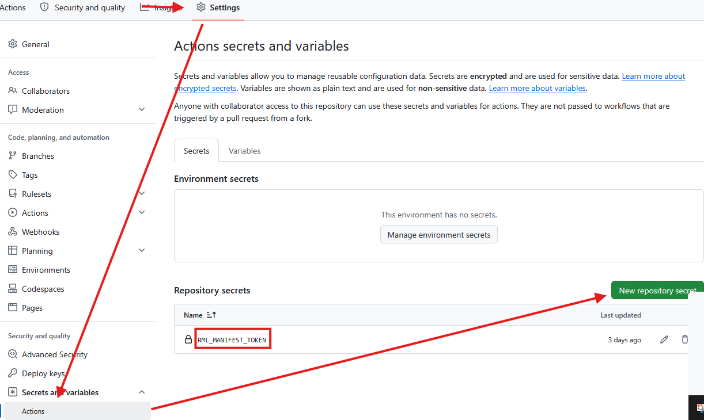
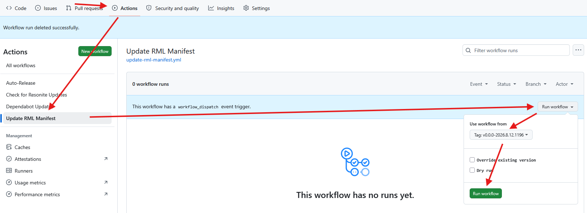

# RMLModTemplate
[](https://github.com/mpmxyz/RMLModTemplate/actions/workflows/build-release.yml) [](https://github.com/mpmxyz/RMLModTemplate/actions/workflows/check-for-resonite-updates.yml)

This is a simple template to develop mods for [Resonite](https://resonite.com/) using [Resonite Mod Loader](https://github.com/resonite-modding-group/ResoniteModLoader) (RML).

It incorporates learnings from [a previous template](https://github.com/mpmxyz/ResoniteSampleMod):
- It focuses on a single mod loader. (RML because MonkeyLoader can load RML mods but not the other way around.)
- Github workflows are kept at a minimum. Instead it uses shell scripts that can also be run locally for testing.
- No Steam login is necessary. It is expected that the user updates a fork of [mpmxyz/ResoniteAssemblies](https://github.com/mpmxyz/ResoniteAssemblies) from their local machine.
  - This is as simple as:
    ```
    .\make.bat OR ./make.sh
    git add *
    git commit -m 'whatever'
    git push
    ```
  - The project uses a local Resonite install when the environment variable `ResonitePath` is set.
- CI/CD is simplified so that a simple push to main will publish a new release.
- The release version number is now dictated from the code.
  - You cannot mismatch or accidentally release a duplicate version number!
- A build for a new Resonite version is automatically triggered at most 3 hours after it has been pushed to the fork of [mpmxyz/ResoniteAssemblies](https://github.com/mpmxyz/ResoniteAssemblies).
- A workflow to publish mods on the [Resonite Mod Manifest](https://github.com/resonite-modding-group/resonite-mod-manifest) exists but it needs to be [manually triggered via a Github action](https://github.com/TODO_TemplateAuthor/TODO_TemplateModName/actions/workflows/update-rml-manifest.yml). (Reason: It causes volunteers to verify your mod. Don't spam!)

## How to get started
1. [Create a repository](https://github.com/new?template_name=RMLModTemplate&template_owner=mpmxyz) with this as a template!
2. Clone the repository!
3. Ensure the enviroment variable `ResonitePath` points to the Resonite install directory!
4. Run `setup-template-names.sh` to edit author and mod names!
5. Start coding!
6. A public fork of [mpmxyz/ResoniteAssemblies](https://github.com/mpmxyz/ResoniteAssemblies) is required to publish releases.

## How to setup the Resonite Mod Manifest workflow
0. Make sure you understand the process! (see [resonite-modding-group/resonite-mod-manifest](https://github.com/resonite-modding-group/resonite-mod-manifest))
1. Own a fork of [resonite-modding-group/resonite-mod-manifest](https://github.com/resonite-modding-group/resonite-mod-manifest) under your Github user account!
2. Create a personal access token (PAT) that allows pushing to the fork!
   
  - `Profile Icon`/`Settings`/`Developer settings`/`Personal access tokens`/`Fine-grained tokens`/`Generate new token`
  - `Name`/`Description`: your own choice
  - `Expiry date`: You need to decide how you trade-off security vs. how often you have to replace tokens in all projects.
  - `Repository access`: `Only select repositories`: `<YOUR_USERNAME>/resonite-mod-manifest`
  - `Permissions`:
    - `Repositories/Contents`: `Read and write`
  - Click `Generate token`!
  - Copy the token from the next page! You can save it in a password manager if you want to reuse it in the future.
3. Add the token as the secret `RML_MANIFEST_TOKEN` to your project!

  - `Respository`/`Settings`/`Secrets and variables`/`Action`/`New repository secret`
  - Set `Name` to `RML_MANIFEST_TOKEN`!
  - Paste the token into `Secret`!
  - Click `Add secret`!

## How to publish a release
1. Ensure you have incremented the version number in `TODO_TemplateModName.VERSION_CONSTANT`!
2. Push/merge your changes into the `main` branch on GitHub!
3. Wait until the workflow `build-release` finished successfully!
4. Your new version has been released. Edit the release notes to explain your changes!

## How to rebuild for a new Resonite version
1. [Update the fork](https://github.com/mpmxyz/ResoniteAssemblies/blob/main/README.md#update-workflow) of `mpmxyz/ResoniteAssemblies`!
2. Either
   - wait until the workflow [`check-for-resonite-updates`](.github/workflows/check-for-resonite-updates.yml) runs automatically (max. 3 hours)
   - or [trigger it manually](https://github.com/TODO_TemplateAuthor/TODO_TemplateModName/actions/workflows/check-for-resonite-updates.yml).
   
## How to add a release to the Resonite Mod Manifest
0. Don't forget to check that you have [prepared the workflow](#how-to-setup-the-resonite-mod-manifest-workflow)!
1. Make sure the release has been created using the workflow `build-release`!
2. Run the workflow [`Update RML Manifest`](https://github.com/TODO_TemplateAuthor/TODO_TemplateModName/actions/workflows/update-rml-manifest.yml) on the release tag! Release tags are in the format `v<MOD_VERSION>-<RESONITE_VERSION>`.


## The following section can be used as a base for your own README.md:

# TODO_TemplateModName

[](https://github.com/TODO_TemplateAuthor/TODO_TemplateModName/actions/workflows/build-release.yml) [](https://github.com/TODO_TemplateAuthor/TODO_TemplateModName/actions/workflows/check-for-resonite-updates.yml)

TODO: The pitch - why should one need this mod?

## Installation
1. Install [ResoniteModLoader](https://github.com/resonite-modding-group/ResoniteModLoader)!
1. Place [TODO_TemplateModName.dll](https://github.com/TODO_TemplateAuthor/TODO_TemplateModName/releases/latest/download/TODO_TemplateModName.dll) into your `rml_mods` folder! This folder should be at `C:\Program Files (x86)\Steam\steamapps\common\Resonite\rml_mods` for a default install. You can create it if it's missing, or if you launch the game once with ResoniteModLoader installed it will create this folder for you.
1. Start the game! If you want to verify that the mod is working you can check your Resonite logs.
1. TODO: Add extra steps if necessary!

## Usage / Screenshots
1. TODO: Explain how the mod is used!
1. TODO: Add visual examples so readers understand without running the mod!

