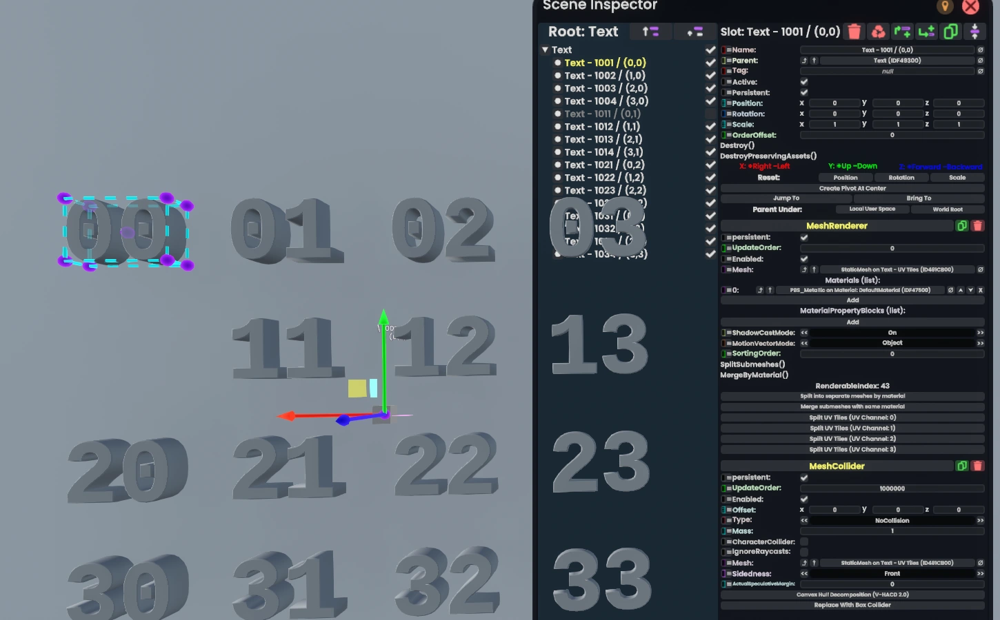

# ResoniteModularSearch

 

This mod for [Resonite](https://resonite.com/) allows searching and editing the world hierarchy based on composable search filters.

The mod itself is modular and it is intended to be extensible via a yet to be published specification. 

Available filters include but are not limited to:
- Values and References
- Regular Expressions
- Dynamic Impulses
- Dynamic Variables

It is possible to compose more complex searches via subqueries.
For example you can find all elements:
- `of type Slot`
- `containing a MeshRenderer`
  - `with a SyncElement` (basic type of a property)
	- `referencing a StaticMesh`

## Installation
1. Install [ResoniteModLoader](https://github.com/resonite-modding-group/ResoniteModLoader)!
1. Place [ResoniteModularSearch.dll](https://github.com/mpmxyz/ResoniteModularSearch/releases/latest/download/ResoniteModularSearch.dll) into your `rml_mods` folder! This folder should be at `C:\Program Files (x86)\Steam\steamapps\common\Resonite\rml_mods` for a default install. You can create it if it's missing, or if you launch the game once with ResoniteModLoader installed it will create this folder for you.
1. Start the game! If you want to verify that the mod is working you can try to open a search window as demonstrated in the next section.

## Usage / Screenshots
1. The mod can only be interacted with when one has builder permissions within a session.
2. Equip Resonite's `DevTool`! (default or custom)
3. There are multiple ways to create a search window:
- Context Menu -> `Create New...` -> `Search & Replace Window`
- If enabled in the settings (default: yes):
  - Context Menu -> `Search from Root`
  - Grabbing a slot -> Context Menu -> `Search from ...`
  - Grabbing a reference -> Context Menu -> `Search for references to ...`
  - Grabbing a value -> Context Menu -> `Search for occurrences of ...`
4. The search can now be customized.
- TODO: search root
- TODO: adding a filter
- TODO: filter config
- TODO: filter list
5. Click the `Search` button on the bottom of the search configuration panel!

The search result looks very similar to a normal inspector panel with the following differences:
- The hierarchy view only shows slots that contain at least one search result.
  - The slot's names are prefixed with the number of search results `(<# within slot>/<# within slot or children>)`
- The worker inspector on the right shows only the elements that are part of the search result.
  - Slots, components or users are displayed with all their properties.
  - Additional information is displayed depending on the filter. (i.e. the dynamic variable name of `DynamicVariableInput`)

A major feature is the ability to edit search results.
The exact abilities depend on the used filter.
TODO: continue demonstration

TODO: images for filter config and search result display

